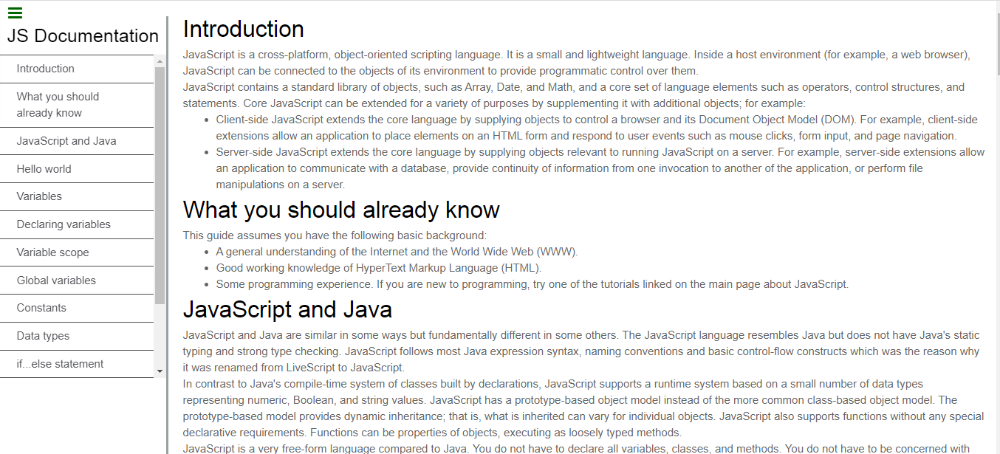

# Technical-Documentation

> FCC: Technical Documentation Page

## Built With

- Html5,
- CSS3

## Live Demo
 [Live Demo](https://raw.githack.com/nellencr/Technical-Documentation/feature/index.html)

👤 **Author**

- Github: [@nellencr](https://github.com/nellencr)
- Twitter: [Nella](https://twitter.com/Nella75794271)
- Linkedin: [Nela Komane](https://www.linkedin.com/in/nela-komane-8866b9192/)

## Getting Started

You may use the following steps to get a local copy:

-Clone project to your local machine 

-cd to the project directory 

-Open project in IDE Open Live Preview through IDE or

-use localhost to view the project in your browser

**Contributing**

You are welcome to make contributions to the repository. Contributions may be made through issues comments and feature requests.

You may find the issues page [here](https://github.com/nellencr/Technical-Documentation/issues)
